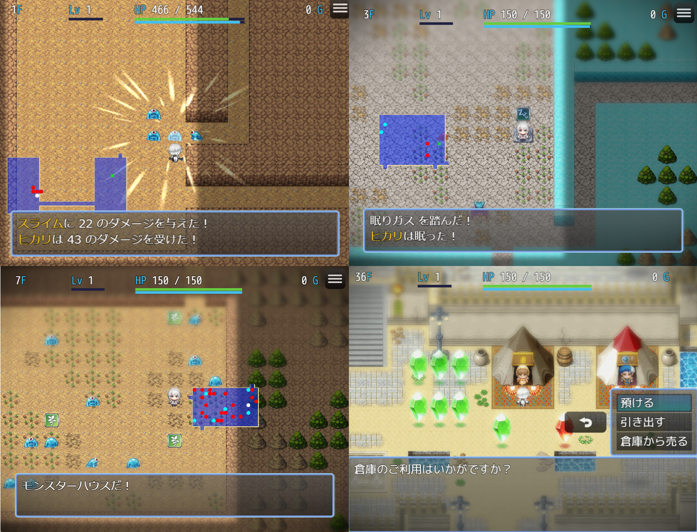

LN_MysteryRogueSystem
==========

RPGツクールMZ 用の、ターン性ローグライクシステムのプラグインです。

いわゆる [不思議のダンジョンシリーズ](https://ja.wikipedia.org/wiki/%E4%B8%8D%E6%80%9D%E8%AD%B0%E3%81%AE%E3%83%80%E3%83%B3%E3%82%B8%E3%83%A7%E3%83%B3) のシステムを導入します。

> **Warning** 開発状況
>
> 本プラグインを使用したひとつのゲームタイトルの制作を終え、無事公開までたどり着くことができました。
> しかしそのタイトルの固有の設定がいくつか、プラグイン内にハードコーディングとして残っています。
> これらを外部から設定できるように仕様化し終えた段階で正式版(1.0.0)として公開する予定です。
>
> 現状のままでもご利用いただけますが、マニュアルの不備や中途半端な状態でテストプロジェクトに組み込まれているシステムがいくつか残っています。
> 随時アップデートしますが、何か不備を見つけましたら、後述のサポート情報よりご報告ください。

ダウンロード
----------

### プラグインのみ

| Version | File |
|---------|------|
| 開発中の最新版 | [:arrow_down: LN_MysteryRogueSystem.js](https://raw.githubusercontent.com/lriki/LN_MysteryRogueSystem/main/js/plugins/LN_MysteryRogueSystem.js) |
| v0.7.0 | 準備中 |

> **Warning** アップデートの注意点
>
> バージョン番号は [セマンティック バージョニング](https://semver.org/lang/ja/) に従います。
> このプロジェクトでは、 v1.0.0 までのマイナーバージョンアップでは後方互換性を保証しません。

### テストプロジェクト

| Version | File |
|---------|------|
| 開発中の最新版 | [:arrow_down: LN_MysteryRogueSystem](https://github.com/lriki/LN_MysteryRogueSystem/archive/refs/heads/main.zip) |
| v0.7.0 | 準備中 |

導入方法
----------

上記テストプロジェクトはそのまま実行できますが、これには画像ファイルなど最小限しか含まれていません。
RPGツクールMZ で新規作成したプロジェクトとマージしてご使用ください。

1. RPGツクールMZ でプロジェクトを新規作成してください。
2. 上記テストプロジェクトからダウンロードした zip ファイルを展開し、 1 のプロジェクトにすべて上書きしてください。
3. テストプレイを実行し、ゲームが起動することを確認してください。

ドキュメント
----------

### ユーザーガイド

- 🌱 [テストプロジェクトの実行方法](./docs/TestProject.md)
- 📚 [マニュアル](https://lriki.github.io/LN_MysteryRogueSystem/latest/)
- ✋ サポート
  - 使い方や仕様・その他の質問 ➡️ [こちらから質問できます](https://github.com/lriki/LN_MysteryRogueSystem/issues/new?template=question.md)
  - 機能要望・提案 ➡️ [こちらから提案できます](https://github.com/lriki/LN_MysteryRogueSystem/issues/new?template=feature_request.md)
  - 不具合報告 ➡️ [こちらから報告できます](https://github.com/lriki/LN_MysteryRogueSystem/issues/new?template=bug_report.md)
  - マニュアルへの要望・不備報告 ➡️ [こちらから報告できます](https://github.com/lriki/LN_MysteryRogueSystem/issues/new?template=docs_request.md)

### 開発ガイド

- 💡 [開発に興味のある方へ](./CONTRIBUTING.md)
- 📦 [ビルド・テスト手順](./docs/Building.md)
- 🛠️ [開発・カスタマイズ情報](./docs/Development.md)

ライセンス・その他
----------

- 本プラグインは [MITライセンス](./LICENSE) の元で提供されます。
- テストプロジェクトには RPGツクールMZ 及び RPGツクールMV のアセットデータが含まれています。これらはRPGツクールシリーズの利用規約に従ってください。(MV のアセットファイル名には "_MV" が含まれています)
- 本プラグインの公開には [TSURUGI SOFT](http://tsurugisoft.com/) 様のご協力をいただきました。この場をお借りして感謝申し上げます。
- 「不思議のダンジョン」は 株式会社スパイク・チュンソフト の登録商標です。本プラグインではマニュアルなどの説明資料にて便宜上この名称を使用することがあります。
