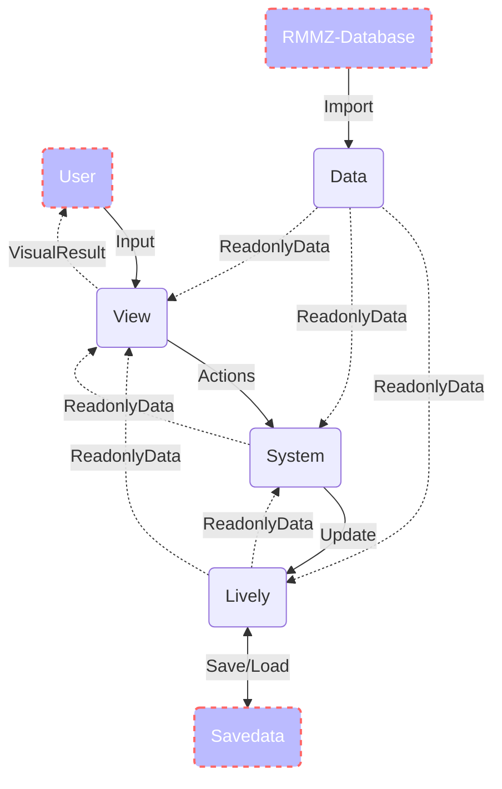

開発・カスタマイズ情報
==========

フォルダ構造
----------

テストプロジェクトの実行を容易にするため、リポジトリには RPGツクールMZ のプロジェクトと、プラグインのビルドシステムが混在しています。

本プラグインとして重要なファイル・フォルダは次のようになります。

```md
- 📁 <Root>
  - 📁 data
    - 📁 mr         : RPGツクールMZ のデータベースの拡張データ
  - 📁 docs         : 設計文書等
  - 📁 mkdocs       : マニュアル
  - 📁 test         : プラグインのユニットテスト
  - 📁 ts
    - 📁 @types     : コアスクリプトの型定義ファイル
    - 📁 extensions : 拡張機能 (アドイン) ⚠️予定
    - 📁 mr         : プラグイン本体
  - 📄 build.ps1               : ビルドスクリプト
  - 📄 format_data.py          : data フォルダに保存されるデータを Git で共有しやすくするための整形ツール
  - 📄 plugin-description.txt  : プラグインの js ファイルの先頭に追加される説明文書
  - 📄 plugin-package.json     : プラグイン開発用の package.json
```

アーキテクチャパターン
----------

プラグインには多くのソースファイルが含まれていますが、おおよそ次のようなグループと関係を持っています。



### `Data` モジュール

MRシステム用のデータベースです。
ゲーム起動時に RPGツクールMZ のデータベースを変換して保持します。
内容がゲーム中に変化することはありません。

RPGツクールMZのコアスクリプトの `$data` で始まる各データと同様の特徴を持ちます。

このモジュールのクラスは 📁ts/mr/data に保存されており、名前の先頭に `D` が付きます。 (例: DEntity, DSkill)
`MRData` クラスは、このモジュール全体を統括します。

### `Lively` モジュール

ゲーム中に変化するデータ群のモジュールです。
ゲームの世界にどのような Entity が存在しているのか、その Entity の状態やどこにいるのか (HPや座標) などを保持します。
このモジュールに含まれるデータは全てまとめてシリアライズすることで、セーブデータとなります。

RPGツクールMZのコアスクリプトの `$game` で始まるデータや、 `Game_` と名の付くクラスと同様の特徴を持ちます。

このモジュールのクラスは 📁ts/mr/lively に保存されており、名前の先頭に `L` が付きます。 (例: LEntity, LMap)
`MRLively` クラスは、このモジュール全体を統括します。

### `System` モジュール

ゲームの進行管理を行うモジュールです。
主にこのモジュールによって、行動順の制御など、ゲームのルールが表現されます。

RPGツクールMZのコアスクリプトの `Manager` と名の付くクラスと同様の特徴を持ちます。

このモジュールのクラスは 📁ts/mr/system に保存されており、名前の先頭に `S` が付きます。 (例: SGameManager, SScheduler)
`MRSystem` クラスは、このモジュール全体を統括します。

### `View` モジュール

キャラクターのモーションや各種ウィンドウといったゲームの見た目や、プレイヤー操作の処理を行うモジュールです。
RPGツクールMZ のイベント (Game_Event) や Window を使って、 `Lively` の状態をユーザーに表示するのが主な役割です。

RPGツクールMZのコアスクリプトの `Scene_` や `Window_` と名の付くクラスと同様の特徴を持ちます。

このモジュールのクラスは 📁ts/mr/view に保存されており、名前の先頭に `V` が付きます。 (例: VEntity, VMainMenuWindow)
`MRView` クラスは、このモジュール全体を統括します。

### その他のモジュール

- FloorGen: ランダムマップの生成を行う、独立性の高いモジュールです。
- Utility: 主に System モジュールから利用されるユーティリティです。
