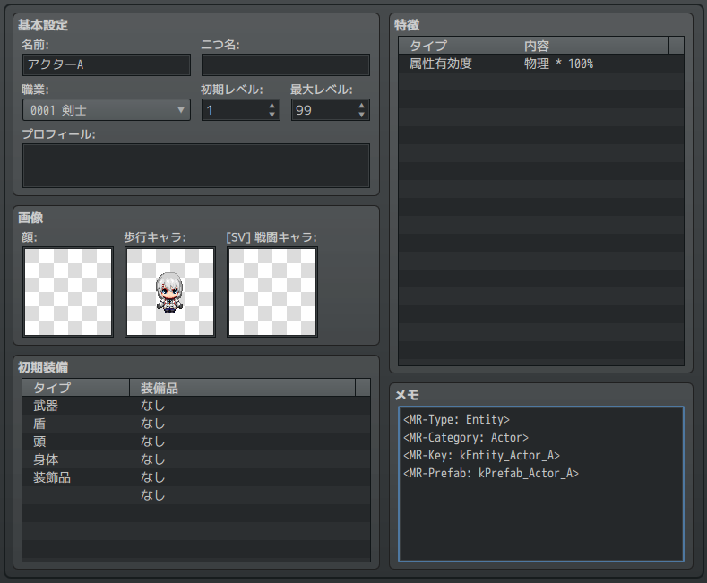
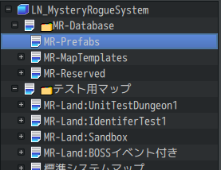

データの設定方法
==========

まず、サンプルプロジェクトではどのように本システム用のデータが設定されているのかを簡単に紹介します。

このチュートリアルを終えた後、実際にゲームデータを打ち込んでいく時のイメージを持っていただければと思います。

データベース
----------

まずはデータベースを見てみましょう。

[アクター] を開き、[メモ] を確認してください。次のような記述が見つかるはずです。

```
<MR-Type: Entity>
<MR-Category: Actor>
<MR-Key: kEntity_ActorA>
<MR-Prefab: kPrefab_ActorA>
```



`MR-` から始まる記述は、本プラグイン用の設定であることを示します。メモ欄、あるいは他の設定でこのような記述がある場合、本システムとして何らかの意味があるデータとみなせます。

他のアイテム、敵キャラ、ステートなども同様の記述がされているのを確認できるはずです。

個々の設定の意味は、後のチュートリアルで説明します。

!!! note
    `MR` は MysteryRogue の略称です。
    今後本プラグインのゲームシステムを `MRシステム` と呼びます。

マップ
----------

エディタ左下にある、マップのツリーを見てみましょう。

データベースで見たように、`MR` から始まるマップがいくつか見つかるはずです。



これらには、ダンジョンそのものを定義するためのマップや、ダンジョンやキャラクターの外観を設定するマップが含まれています。以下は、代表的なマップの概要です。

### ダンジョンマップ

ダンジョンは、マップ名の先頭に `MR-Land:` が付いています。X 座標をフロア番号とみなし、ダンジョンのフロア数、モンスターやアイテムの出現テーブルを設定できます。

### キャラクター外観

アクターは歩行グラフィックを設定できますが、敵キャラやアイテムには設定できません。しかし、MRシステムではアイテムを足元に置いたときなど、アイテムに対するイベントを動的に出現させます。🗂MR-Database > MR-Prefabs では、この動的イベントを設定できます。

より詳細なデータの設定
----------

一般的なプラグイン同様、主要な追加データはデータベースの [メモ] から設定できます。

しかし本プラグインがサポートする追加設定は非常に多く、全て [メモ] で設定することは現実的ではありません。

エディタ上で設定が難しいデータは、プロジェクトフォルダの `data/mr` フォルダの中に保存します。

ファイルフォーマットは様々ですが、詳細設定を行う場合はいずれもテキストエディタで直接編集する必要があります。


