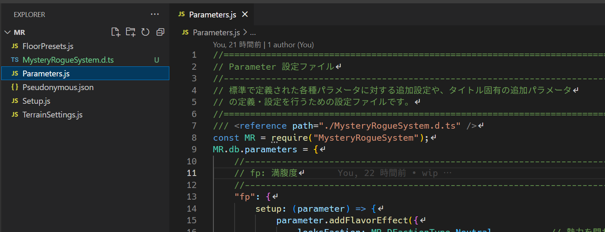
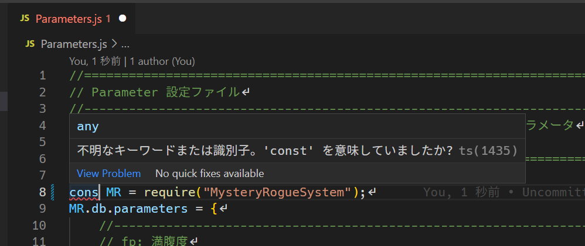
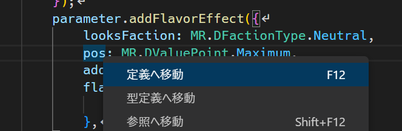
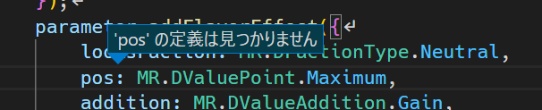

データベースの編集
==========

このページでは、RPG ツクールのデータベースで設定されたデータと、MRシステムで必要となる設定がどのように連携しているのかを説明します。

なおここではエンティティの設定例を示します。これ以外のデータについては次のチュートリアルで説明します。

エンティティ
----------

以前のページで、マップ上に登場できるオブジェクトは全て `エンティティ` であると説明しました。

RPGツクールのデータベースで編集できる次の要素は、すべてエンティティとなりえます。

- アクター
- アイテム
- 武器
- 防具
- 敵キャラ

例えば [敵キャラ] の "スライムA" の [メモ] を見てみましょう。


次のように記述されているはずです。

```
<MR-Type: Entity>
<MR-Key: kEntity_スライムA>
<MR-Prefab: kPrefab_スライムA>
```

- `<MR-Type: Entity>` は、この情報がエンティティであることを示します。
- `<MR-Key: kEntity_スライムA>` は、他の場所 (出現テーブルなど) からこのエンティティを検索するための名前を定義しています。このような名前を `Key` と呼びます。
- `<MR-Prefab: kPrefab_スライムA>` は、このエンティティに対応するプレハブを指定しています。

### Key の命名ルール

```
k【データ種別】_【名前】
```

- 先頭の k は、この名前が Key であることを示す接頭辞です。
- 【データ種別】は、Entity、Prefab の他、この後の説明にもあるような Skill、 State など様々です。
- 【名前】は任意の文字列です。

このルールは必須ではありませんが、Key を見ただけで何のデータなのか分かりやすくするため、サンプルではこのようにしています。

!!! note "名前の後ろの .A や _A は何？"
    同名であるが効果の異なる特殊なアイテムを区別したり、data フォルダ内の名前の全置換をする際の名前衝突を防ぐための接尾辞です。
    例えば「毒矢」と「毒矢の罠」があるとき、「毒矢」だけ名前を変更したいときに「毒矢の罠」まで名前が変わってしまうことの対策です。

    名前の . から後ろは、実際のゲーム画面上には表示されません。

!!! tip "ID ではなく Key で！"
    MRシステムはほぼすべての設定で、ID (アイテムや敵キャラの番号) ではなく Key (MR-Key の値) でデータを設定したり検索します。
    これは、IDにしてしまうとパッと見た時に何を示しているのかわからなかったり、データベースの並び変えをしたときに正しいデータを参照できなくなる問題を回避するためです。

設定ファイル
----------

モンスターのパラメータやアイテムの回復量など、基本的なデータは RPGツクールのデータベースから編集できます。

しかしプラグインがサポートする追加設定は非常に多く、全て [メモ] で設定することは現実的ではありません。

エディタ上で設定が難しいデータは、プロジェクトフォルダの `data/mr` フォルダの中に保存します。

このフォルダには次のようなファイルがあります。

- Pseudonymous.json
- Setup.js
- Parameter.js

### Pseudonymous.json

未識別アイテムの仮名を設定するファイルです。

データベースで定義しているアイテム数に対して仮名が足りない場合、実行時にエラーが発生します。

必要に応じて追加してください。

### Setup.js

モンスターやアイテムなど、データベースで作成した要素に対する様々な追加設定を行うためのファイルです。

設定ファイルの編集方法
----------

非常に多くの情報が書き込まれるため、 [Visual Studio Code](https://azure.microsoft.com/ja-jp/products/visual-studio-code/) などプログラミング用のテキストエディタで編集することをお勧めします。

1. メニューの [ファイル] > [フォルダーを開く] から、プロジェクトフォルダ内の `data/mr` フォルダを開きます。<br>
    
2. 左サイドのエクスプローラからファイルを選択して編集します。<br>
    
3. メニューの [ファイル] > [保存] で編集内容を保存します。


!!! tip "文法エラーのチェック"
    括弧が足りなかったり予約語の名前が間違っている場合、赤い下線でエラーのある個所がハイライトされます。
    マウスカーソルを乗せると詳細が確認できます。
    

!!! tip "変数や関数の説明"
    変数や関数にマウスカーソルを乗せると、その説明が表示されます。
    
    全てが文書化されているわけではありませんが、今後のアップデートで追加される予定です。

!!! tip "入力補完"
    編集個所に応じて、入力候補となる変数名などが推測できる場合は、そのリストが表示されます。
    タイプミスの防止に活用してください。
    

!!! tip "変数名の確認"
    設定がうまく反映されない場合、変数名が間違っているかもしれません。
    間違っている場合、変数を右クリックして [定義へ移動] すると、「定義が見つかりません」と表示されます。
    
    


