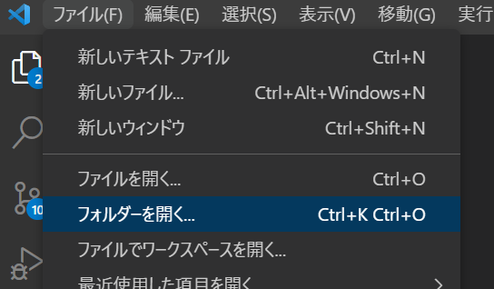
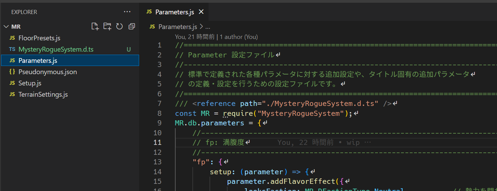
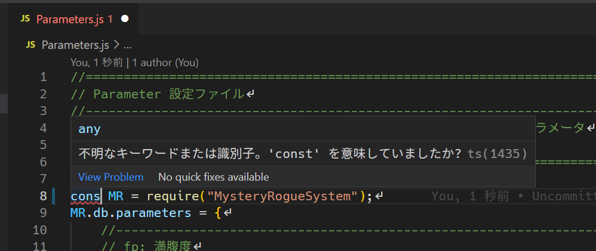
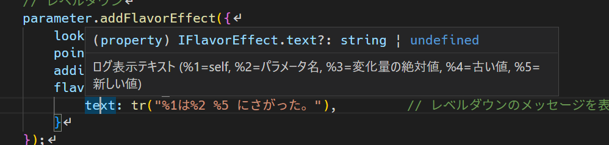
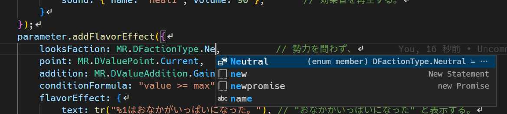
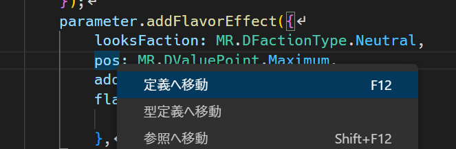
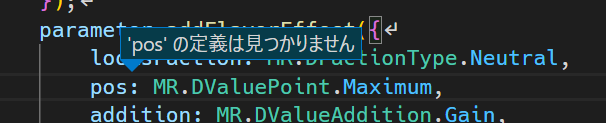

詳細データの編集
==========

モンスターのパラメータやアイテムの回復量など、基本的なデータは RPGツクールのデータベースから編集できます。

しかしプラグインがサポートする追加設定は非常に多く、全て [メモ] で設定することは現実的ではありません。

このページでは、データベース以外からのデータ設定方法を説明します。

設定ファイル
----------

エディタ上で設定が難しいデータは、プロジェクトフォルダの `data/mr` フォルダの中に保存します。

このフォルダには次のようなファイルがあります。

- Pseudonymous.json
- Setup.js
- Parameter.js

### Pseudonymous.json

未識別アイテムの仮名を設定するファイルです。

データベースで定義しているアイテム数に対して仮名が足りない場合、実行時にエラーが発生します。

必要に応じて追加してください。

### Setup.js

モンスターやアイテムなど、データベースで作成した要素に対する様々な追加設定を行うためのファイルです。

編集方法
----------

非常に多くの情報が書き込まれるため、 [Visual Studio Code](https://azure.microsoft.com/ja-jp/products/visual-studio-code/) などプログラミング用のテキストエディタで編集することをお勧めします。

1. メニューの [ファイル] > [フォルダーを開く] から、プロジェクトフォルダ内の `data/mr` フォルダを開きます。 
    
2. 左サイドのエクスプローラからファイルを選択して編集します。 
    
3. メニューの [ファイル] > [保存] で編集内容を保存します。

!!! tip "文法エラーのチェック"
    括弧が足りなかったり予約語の名前が間違っている場合、赤い下線でエラーのある個所がハイライトされます。
    マウスカーソルを乗せると詳細が確認できます。
    

!!! tip "変数や関数の説明"
    変数や関数にマウスカーソルを乗せると、その説明が表示されます。
    
    全てが文書化されているわけではありませんが、今後のアップデートで追加される予定です。

!!! tip "入力補完"
    編集個所に応じて、入力候補となる変数名などが推測できる場合は、そのリストが表示されます。
    タイプミスの防止に活用してください。
    

!!! tip "変数名の確認"
    設定がうまく反映されない場合、変数名が間違っているかもしれません。
    間違っている場合、変数を右クリックして [定義へ移動] すると、「定義が見つかりません」と表示されます。
    
    
