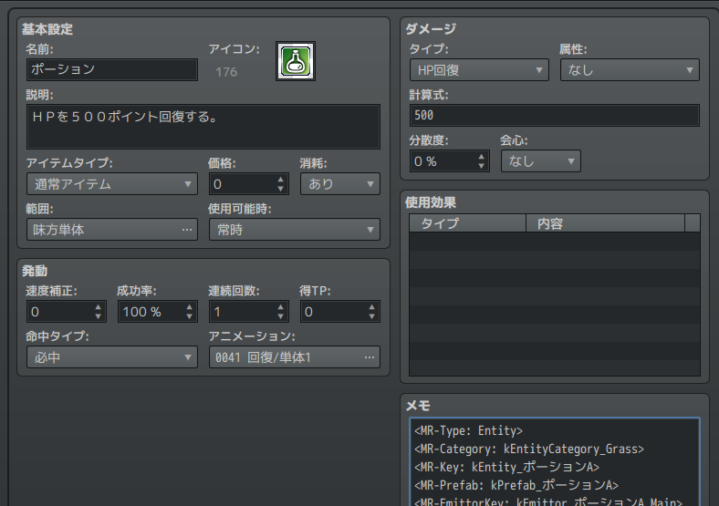
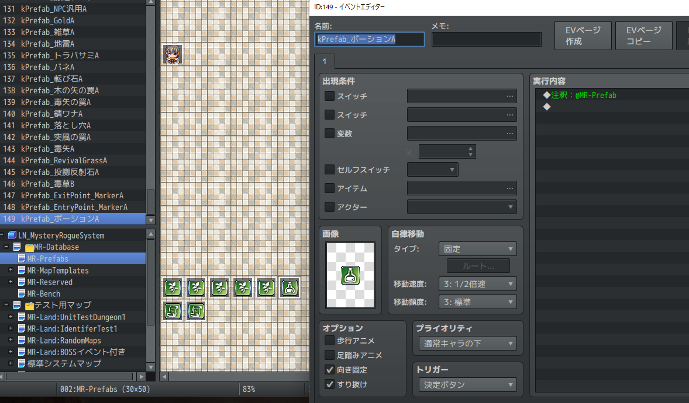
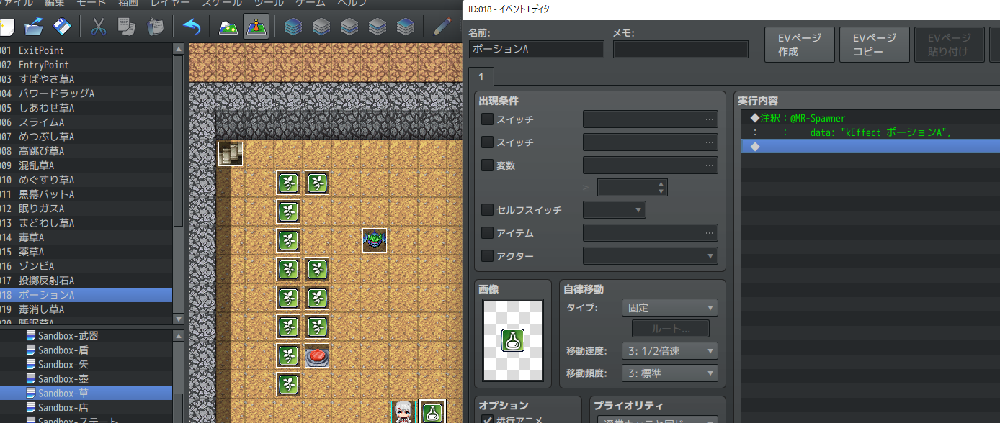

アイテムエンティティの追加
==========

ここでは RPGツクールのデータベースからアイテムを追加し、ダンジョンに新たなアイテムを登場させる方法を説明します。

データベースでアイテムを追加する
----------

まず最初に、データベースで新規アイテムを追加しましょう。設定は次のようにします。



- 名前 : ポーション
- アイコン : 適当なアイコン
- 説明 : ＨＰを５００ポイント回復する。
- アニメーション : 回復/単体1
- ダメージ
    - タイプ : HP回復
    - 計算式 : 500
    - 分散度 : 0%
- メモ :
```
<MR-Type: Entity>
<MR-Key: kEntity_ポーションA>
<MR-Prefab: kPrefab_ポーションA>
<MR-EmittorKey: kEmittor_ポーションA_Main>
<MR-EffectKey: kEffect_ポーションA_Main>
```

`MR-EmittorKey` と `MR-EffectKey` の説明は次のページで行います。

!!! note
    データベースから設定できる項目は [エディタで設定できる情報](../../2-feature/import-db-item.md) を参照してください。

プレハブを追加する
----------

続いて新しいプレハブを追加します。マップの `🗂MR-Database` > `MR-Prefabs` 内に新たなイベントを作成しましょう。設定は次のようにします。



- 名前 : kPrefab_ポーションA
- 画像 : 適当なキャラクターイメージ
- 実行内容 : 注釈: @MR-Prefab


テスト用マップで動作確認する
----------

最後に、アイテムが正しく追加されているかをテストします。

`🗂テスト用マップ` > `MR-Land:UnitTestDungeon1` > [Fixed] > `Sandbox-草` に次のような注釈を持つイベントを追加します。

```
@MR-Spawner
    kEffect_ポーションA
```



プレイヤーの初期位置も、このイベントの隣にしておきます。

設定出来たら、テストプレイを実行してみましょう。

アイテムの上に移動するとアイテムを手に入れることはできます。
しかし飲むことはできず、投げ当てたりしても効果が発揮されません。

これはアイテムの効果がどのようなアクションに応じて発動するかが設定されていないためです。

続いて、この設定について説明します。

!!! tip
    @MR-Spawner イベントの [画像] 設定はダミーの設定です。
    実際にゲーム上で表示されるのはプレハブで設定された画像です。
    ただし、エディタ上での利便性のため、通常は同一の画像を設定することをお勧めします。


