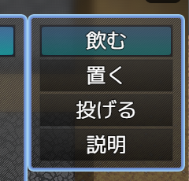
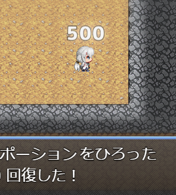
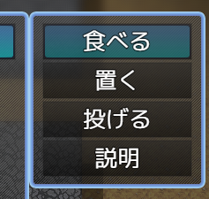

アクションとリアクション
==========

ここではユニットの様々な行動を示す `アクション` と、それらに応じてアイテムの効果等を発動する `リアクション` について説明します。

アクション
----------

ユニットの様々な行動のことを `アクション` と呼びます。

アクションには次のようなものがあります。

- 食べる
- 読む
- 投げる
- 攻撃 (通常攻撃スキルの発動)
- (投げられたものが) 衝突する

食べる、投げるといった直感的な行動だけではなく、「衝突する」のように、アイテムの効果等を発動する起点となる様々な要因を扱います。

リアクション
----------

`リアクション` は、エンティティがアクションに反応して何を行うかといった情報です。

例えば、草アイテムは食べられたら効果を発動し、巻物アイテムは読まれたら効果を発動します。食べることができる巻物を作ることもあるでしょう。

このように、アイテムのエンティティがどのようなアクションに反応するのかは、個々のエンティティに設定する必要があります。

リアクションを設定する
----------

まず、 `data/mr/Entities.js` ファイルに次の設定を追加して動作を見てみましょう。説明は後ほど行います。

```js
"kEntity_ポーションA": Entity({
    reactions: [
        Reaction({
            actionKey: "kAction_Eat",
            emittorKeys: ["kEmittor_ポーションA_Main"],
            commandName: "飲む",
        }),
    ],
}),
```

テストプレイから動作を確認すると、[飲む] というコマンドが増えています。



コマンドを選択すると、アイテムを使用することができます。



!!! note
    テストプロジェクトで設定されている `[Test]ポーション (kEntity_TestポーションA)` はこのチュートリアルで作成するのと同じアイテムです。
    迷ったときは参考にしてください。

設定の説明
----------

さて、さきほどの設定はどのような意味を持っているのでしょうか。
ファイルの全体像から確認していきましょう。

### ファイル全体

設定ファイルは JavaScript で記述します。Visual Studio Code と組み合わせることで入力補間などを利用でき、タイプミス防止や設定の説明が探しやすくなるため、 JavaScript を採用しています。

設定にあたっては、関数や制御構文といったプログラミングスキルは不要です。

```js
/// <reference path="./MysteryRogueSystem.d.ts" />
const MR = require("MysteryRogueSystem");
MR.db.entities = {
    【Entity の設定】
};
```

設定を記述するのは `MR.db.entities =` に続く `{ ... }` の中です。この周辺のコードは変更しないでください。

エンティティひとつ分の設定は次のようになります。

```js
"EntityのKey": Entity({ ... }),
```

`EntityのKey` は、データベースのメモ欄で `<MR-Key: ...>` によって指定したキーです。続く `Entity({ ... })` の中に、エンティティに対する追加の設定を記述します。

### reactions と Reaction

エンティティはデフォルトではリアクションが割り当てられていません。つまり、どのようなアクションにも反応しないことになります。

`Reaction({ ... })` の中に書いた設定を元に新たなリアクションを登録することで、アクションに反応して効果を発動できるようになります。

### actionKey

反応したいアクションの Key を指定します。 `kAction_Eat` はデフォルトで用意されている `食べる` アクションを示します。

### emittorKeys

アクションに反応して発動したい `エミッター` の Key を指定します。
エミッターについては次のページで説明します。

### commandName

このアクションをコマンドリストに表示する際の名前です。

kAction_Eat のデフォルトの名前は `食べる` ですが、それをアイテムごとに変更したい場合に指定します。

なお、この設定を省略するとデフォルトのコマンド名になります。




