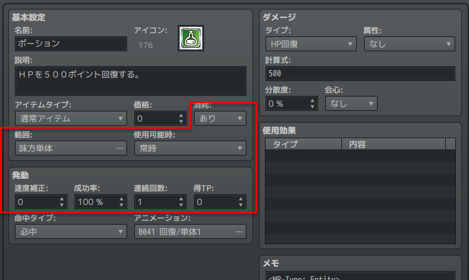
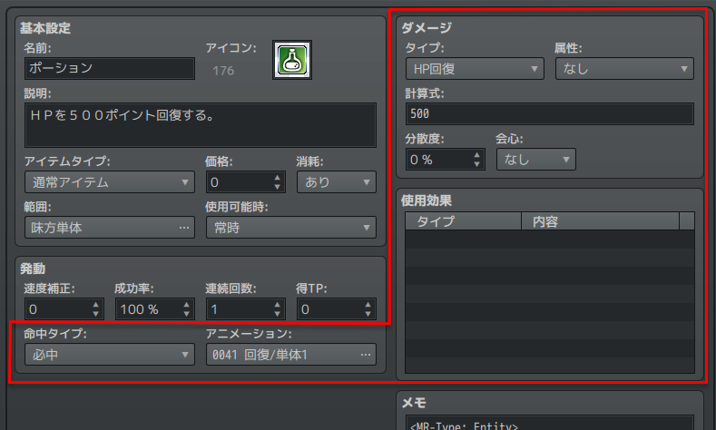
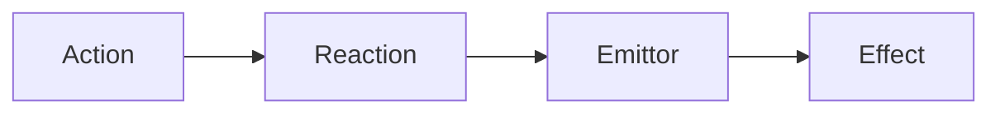

エミッターとエフェクト
==========

MRシステムではアイテムなどの様々な効果や発動条件を表現するために、 `エミッター` と `エフェクト` という2つの仕組みがあります。

エミッター
----------

`エミッター (Emittor)` はアイテムやスキルの効果を「発動すること」に関する情報です。

次のような情報が含まれます。

- 発動条件 (消費 MP など)
- 効果範囲
- 発動側のアニメーション

ツクールのアイテムエディタの左側に表示されているような情報が該当します。

エミッターはデータベースのメモ欄で `MR-EmittorKey` を指定すると、設定ファイルからこの Key でアクセスしたり、設定を追加できるようになります。

エフェクト
----------

`エフェクト (Effect)` はエミッターにより発動された「効果そのもの」に関する情報です。

次のような情報が含まれます。

- ダメージ量・回復量
- 付加・解除するステート
- バフ・デバフ
- 対象側のアニメーション

ツクールのアイテムエディタの右側に表示されているような情報が該当します。

エミッターはデータベースのメモ欄で `MR-EffectKey` を指定すると、設定ファイルからこの Key でアクセスしたり、設定を追加できるようになります。

リアクションとの関係
----------

前ページでリアクションを設定したときに、emittorKeys にエミッターの Key を指定しました。
これによって、[食べる] アクションに反応して、特定のエミッターを発動できるようになった、というわけです。

アクションからエフェクトにたどり着くまでには、次のような流れを辿ることになります。

例えば次のようなイメージを持ってください。

1. Action: [食べる] を実行する。
2. Reaction: [食べる] に反応して、 Emittor を起動する。
3. Emittor: 消費MPや効果範囲を計算して Effect を適用する。
4. Effect: HPを回復する。

!!! note "なぜ設定はこんなに細かく分かれているの？"
    アイテムひとつとっても、様々な状況で複数の効果を発動出来るものがあります。
    例えば一般的な草アイテムは、HP回復などの主効果の他に、満腹度を微回復させる副効果があります。このような場合、ひとつのアイテムは複数の Effect を持つことになります。

