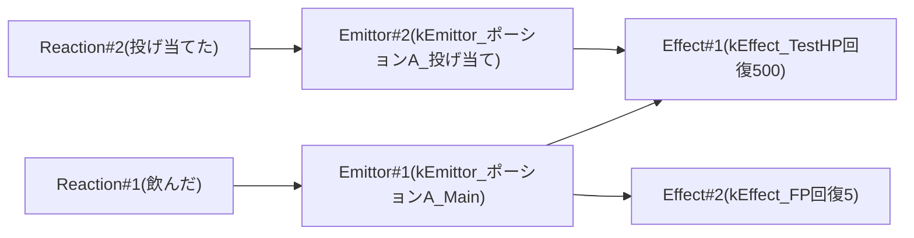
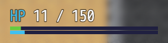

投げ当てと副効果
==========

このチュートリアルでこれまで作成してきたアイテムは飲んだ時にHPを回復するだけでした。
ここでは次の効果を実装し、ひとつのアイテムとして仕上げます。

- 飲んだ時に満腹度(FP)を回復する。
- 投げ当てた時に相手の HP を回復する。ただし、このとき FP は回復しない。

リアクション、エミッター、エフェクトの関連は次のようになります。



次の要素は既に作成しています。

- [飲んだ]リアクション
- kEmittor_ポーションA_Main
- kEffect_TestHP回復500

ここでは次の要素を作成し、それぞれの関連性を設定していきます。

- kEffect_FP回復5
- kEmittor_ポーションA_投げ当て
- [投げ当てた]リアクション

満腹度(FP)の回復
----------

満腹度(FP) はRPGツクールの標準パラメータではありません。MRシステム用の追加パラメータとして扱われます。追加パラメータはRPGツクールのデータベースから編集することはできません。設定ファイルでエフェクトを追加する必要があります。

`data/mr/Effects.js` に次のような設定を追加します。

```js
"kEffect_FP回復5": Effect({
    parameterDamages: [
        ParameterDamage({
            parameterKey: "fp",    // FPを、
            type: "recover",       // 回復する。
            formula: "500",        // 値は5%。
            silent: true,          // メッセージを表示しない。
        }),
    ],
}),
```

!!! note パラメータFPについて
    パラメータの詳細は次のチュートリアルで説明します。
    FPはパーセンテージでウィンドウに表示されますが、内部的には 10000 を 100% とする整数値です。

!!! warning
    v0.8.0 では `kEffect_FP回復5` は Effects.js に既に追加されています。
    これを利用してもかまいません。そうでない場合、別の Key 名を使ってください。

続いて、 `data/mr/Emittors.js` に次の設定を追加します。

```js
"kEmittor_ポーションA_Main": Emittor({
    targetEffectKeys: [
        "kEffect_HP回復500",
        "kEffect_FP回復5",
    ],
}),
```

<!-- `kEmittor_ポーションA_Main` には最初から `kEffect_HP回復500` が追加されています。この設定は、そこへさらに `kEffect_FP回復5` を追加することを示しています。 -->

設定したらテストプレイで動作確認してみましょう。

使用前:


使用後: 


!!! tip デバッグコマンド
    動作確認のために毎回 HP や FP を減らすのは大変です。 [](../1-first/8-debug-command.md) で説明したデバッグ機能で次のコマンドを実行すると、それぞれプレイヤーの HP を 10、FP を 1000(10%) にできます。
    ```
    MR.setPlayerParameter("hp", 10)
    MR.setPlayerParameter("fp", 1000)
    ```

投げ当て
----------

`data/mr/Emittors.js` に次の設定を追加します。

```js
"kEmittor_ポーションA_投げ当て": Emittor({
    targetEffectKeys: [
        "kEffect_HP回復500",
    ],
}),
```

続いて、 `data/mr/Entities.js` の `kEntity_ポーションA` に次の設定を追加します。

```diff
 "kEntity_ポーションA": Entity({
     reactions: [
         Reaction({
             actionKey: "kAction_Eat",
             emittorKeys: ["kEmittor_ポーションA_Main"],
             commandName: "飲む",
         }),
+        Reaction({
+            actionKey: "kAction_Collide",
+            emittorKeys: ["kEmittor_ポーションA_投げ当て"],
+        }),
    ],
 }),
```

設定したらテストプレイで動作確認してみましょう。

モンスターに投げ当てることで、相手の HP が回復します。


