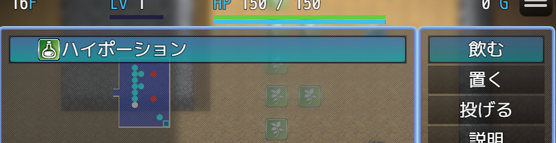
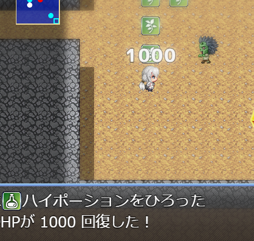

エンティティテンプレート
==========

ここまでで、ひとつの回復アイテムが完成しました。
しかしこれまでのように多くの設定を全てのアイテムに対して行うのは非常に大変です。

作業の負担を軽減するため、ここでは典型的なアイテムの仕様を簡単に設定できる `エンティティテンプレート` について説明します。

エンティティテンプレートを使う
----------

エンティティテンプレートを使って、新しいアイテムを作ってみましょう。

[本チュートリアル冒頭](./2-item-entity.md) と同じように回復アイテムを追加してください。

1. データベースにアイテムを追加する
2. プレハブを追加する
3. テスト用マップに登場させる

先ほど作ったアイテムと区別するため、追加するアイテムの名前は `ハイポーション` 、 `回復量1000` とします。

そしてアイテムのメモ欄は次のようにします。

```
<MR-Type: Entity>
<MR-Key: kEntity_ハイポーションA>
<MR-Prefab: kPrefab_ハイポーションA>
<MR-EntityTemplate: kEntityTemplate_Grass>
```

末尾に `<MR-EntityTemplate: kEntityTemplate_Grass>` を新たに指定しています。

この状態でテストプレイしてみましょう。（設定ファイルの変更は不要です）





設定ファイルは変更しませんでしたが、 [飲む] アクションや、投げ当て等で効果が発動します。

このように、典型的な動作はエンティティテンプレートを指定するだけで、多くの設定を省略することができます。

!!! note
    エンティティの設定とエンティティテンプレートを同時に使用した場合、エンティティの設定が後から追加される（優先される）形になります。

!!! warning
    エンティティテンプレートは便利ですが、アイテムの動作はほぼ固定されてしまいます。
    例えば食べた時と投げ当てた時でダメージ量や効果が違うアイテムを作りたい場合は、エンティティテンプレートを使わないで、設定をひとつずつ行う必要があります。

エンティティテンプレートの設定変更
----------

原作システムに則る場合、ほとんどの場合エンティティテンプレート自体のの設定変更は不要です。

もし変更したい場合は `data/mr/EntityTemplates.js` を編集します。

例えば上記で使用した草アイテム用のテンプレートは次のようになっています。

```js
"kEntityTemplate_Grass": EntityTemplate({   // kEntityTemplate_Grass という名前のテンプレートは、
    type: "Grass",                          // 草アイテム用のテンプレートである。
    recoverFP: 500,                         // 食べた時に、満腹度を 500(5%) 回復する。
}),
```

`recoverFP` を変更すると、このテンプレートを使っているすべてのアイテムの FP 回復量が変わります。
