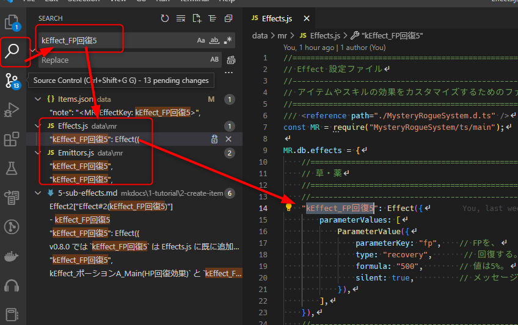
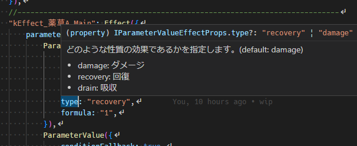

まとめ・設定の探し方
==========

本チュートリアルでは、様々な効果を持つ買い手無を作成するために必要な要素について説明しました。

- アクション
- リアクション
- エミッター
- エフェクト
- カテゴリ
- トレイト
- エンティティテンプレート

それぞれの要素にはさらに詳細がありますが、すべてのアイテムはこれらの組み合わせで成り立ちます。
組み合わせを工夫することで、オリジナルのユニークなアイテムも作成できるようになるでしょう。

設定の探し方
----------

最後に、テストプロジェクトで用意されている各アイテムの設定の探し方を紹介します。
マニュアルの更新が追い付いていないアイテムの機能を探す際に活用してみてください。

とは言っても、アイテムの設定の玄関となる重要な要素は上記の通りです。
チュートリアルの中で、それぞれが Key を持つことは説明しました。この Key を追うことで、設定を探すことができます。

### Visual Studio Code で検索する

1. データベースのメモ欄にある `<MR-EmittorKey>` や `<MR-EffectKey>` の値を確認する。
2. Visual Studio Code の [ファイル] > [フォルダーを開く] から、プロジェクトフォルダ (game.rmmzproject ファイルのあるフォルダ) を開く。
3. 左側のサイドバーの検索をクリックする。 (または Ctrl+Shift+F)
4. 1 で確認した Key 名を検索する。

これで、プロジェクトフォルダ内の全テキストファイルを検索できます。

### 設定の意味を確認する

Visual Studio Code でプロパティ名の上にマウスを乗せると、その意味が表示されます。

### データベースの設定

データベースから設定できる項目は [エディタで設定できる情報](../../2-feature/import-db-item.md) を参照してください。

    
