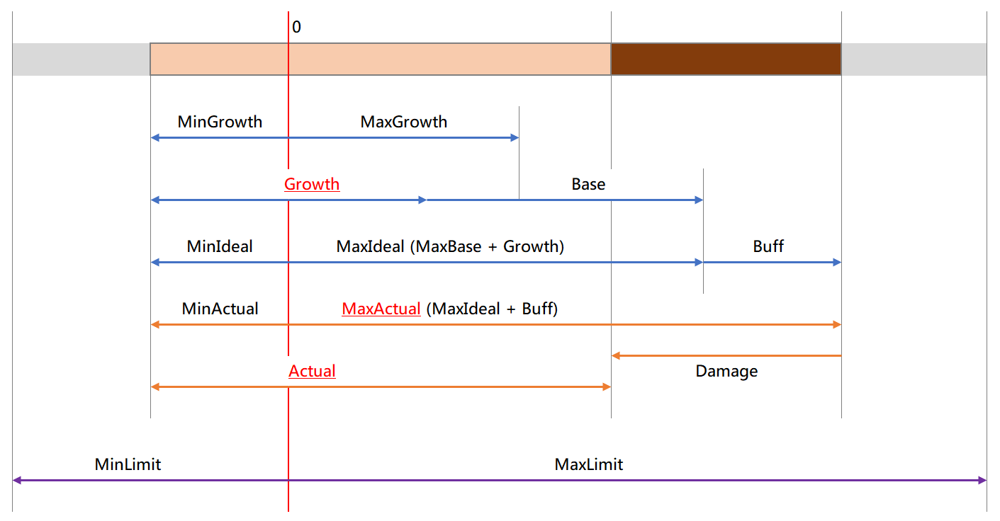

パラメータ
==========

パラメータとは HP や攻撃力などの、キャラクターが持っている能力値です。

ここでは MRシステムにおけるパラメータの仕組みと、設定方法について説明します。

パラメータとして扱う情報
----------

RPGツクール上で「通常能力値」と表現されている HP や ATK(攻撃力) などは、MRシステムでも同様にパラメータとして扱います。
MRシステムではこれらに加えて、次のような能力値もパラメータとなります。

- レベル
- 経験値
- 満腹度
- ちから
- （杖などの）使用回数
- （壺などの）容量

各パラメータは、現在値、最大値、バフ値、限界値などで構成されます。
標準システムの HPと最大HP の関係を、すべてのパラメータが持っていると考えてください。
特徴的な例を挙げると、通常の HP と同じような方法で、次のようなことができるような仕組みとなっています。

- 満腹度にダメージを与える（おなかが減る）
- 満腹度の最大値を増やす
- 武器の強さにダメージを与える（サビ罠など）
- レベルに対してデバフを与える（一時的にレベルダウン）

パラメータの全体像
----------

アイテムの効果をカスタマイズするためには、パラメータの現在値や最大値がどのように算出されるのかを知っておく必要があります。

パラメータ全体像のイメージは次のようになります。

たくさんの要素がありますが、実際のところ、RPGツクール標準の HP/最大HP の計算方法とほぼ同じです。

特に重要な要素は次の通りです。

- Growth
- MaxActual
- Actual

### Growth (育成値)

成長アイテムなど、レベルアップ要因以外で増減する値です。

MRシステムでは他に「武器の強化値」「これまで取得した総経験値」などが該当します。

### MaxActual (実際の最大値)

実際にプレイヤーに表示する、パラメータの最大値です。一般的な「最大HP」と同じものです。

MRシステムでは他に「最大満腹度」「ちからの最大値」「壺の最大容量」などが該当します。
	
MaxActual は次の要素の影響を受けて算出されます。

- Growth： 育成値
- Base： レベルアップによる基本値 + 装備による上昇値
- Buff： バフ・デバフ
	
### Actual（現在値）

実際にプレイヤーに表示する、パラメータの現在値です。

なお、装備やバフなどによりどれだけ値がインフレしても、Limit (限界値) を超えることはありません。
	
### マイナス値について

装備の強さなどはマイナス値になることがあるため、パラメータはマイナス値を表現できるようになっています。

とはいえ HP が 0 になったら戦闘不能扱いするような、RPGツクールの基本仕様は引き継いでいますので、あくまで装備の強さなど特定のパラメータ専用の仕様と考えてください。

パラメータの設定を確認する
----------

