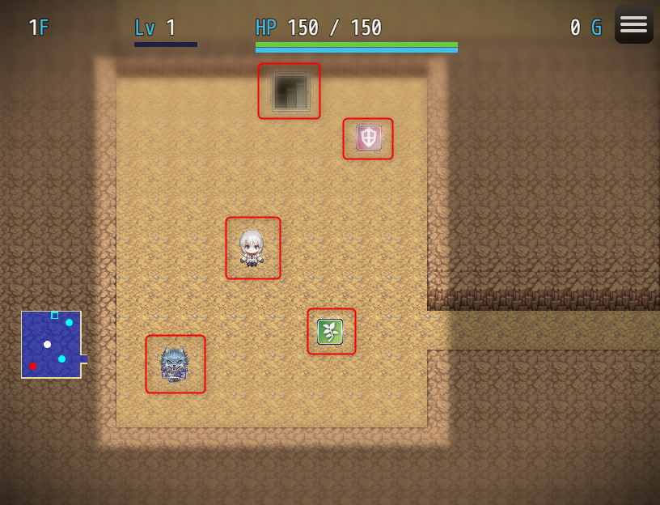
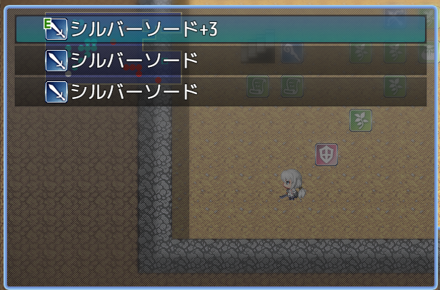
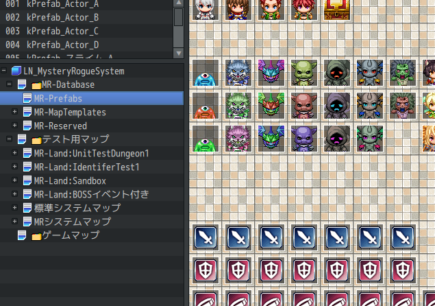
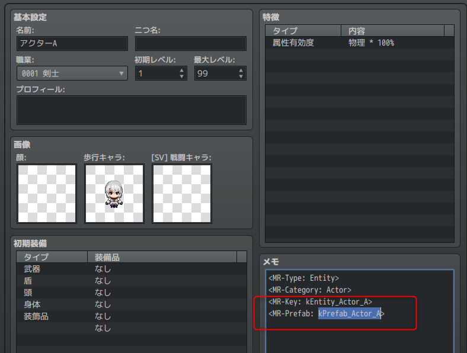
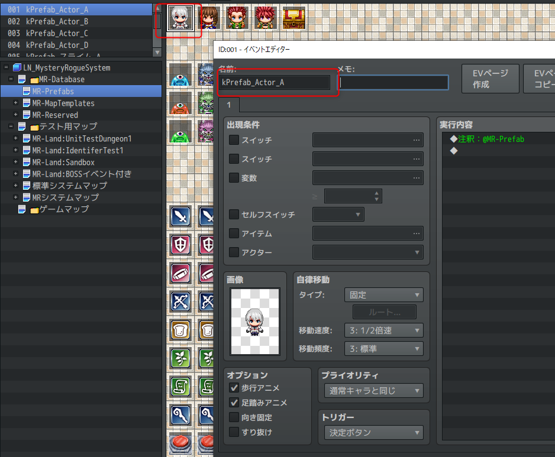

基本概念
==========

本プラグインはツクール上に新たなゲームシステムを実現するために、特別なデータを多く追加します。

その中でも、特にシステムを理解するために重要な要素を説明します。

エンティティ (Entity)
----------

通常、RPGツクールで NPC, ギミック, その他装飾などを作成するときには "イベント" を使います。

MRシステムではこれと似た `エンティティ` と呼ばれる仕組みがあります。
`エンティティ` はMRシステムの管理下の プレイヤーキャラクター、エネミー、アイテムなどのオブジェクトを表します。

イベントと似ていますが、`エンティティ` はゲーム全体で (マップをまたいで) ひとつのオブジェクトを表す点が大きく異なります。

例えば武器を複数手に入れたときを考えてみましょう。

RPGツクール標準のシステムでは、アイテム画面を開いたときに "ショートソード 2" というようにまとめて表示されます。

一方 MRシステムでは、2つの武器は異なるアイテムとしてまとめられずに表示されます。

個々の武器は、+1, +2 といった修正値を振ったり、別のアイテムを合成して特殊能力を付加して育てることができるようになります。またMRシステム管理下のマップで "置く", "投げる" といった行動によって、マップ上に出現させることができます。

このように `エンティティ` は、たとえマップを離れてもゲーム全体として唯一のオブジェクトとして存在できます。

`エンティティ` は武器以外にも、MRシステム上の様々なものを表します。次のリストは一例です。

- プレイヤーキャラクター
- NPC
- 敵キャラ
- アイテム
- 罠
- 階段
- 飛翔体 (矢や魔法弾)

またプレイヤーキャラクターや敵キャラなど、プレイヤーやAIから操作されるエンティティを、 `ユニット` と呼ぶことがあります。

!!! note
    マップ上に登場できるオブジェクトは、すべてエンティティである、とも言えます。
    拡張によって罠を拾ったり、モンスターを捕まえて持ち物に入れる、といったシステムを開発する場合、この考えが重要になります。

プレハブ (Prefab)
----------

`プレハブ` は `エンティティ` の見た目です。MRシステムから特別扱いされるRPGツクールのイベントであると考えてください。

マップ上に出現している `エンティティ` は、自身を画面上に表示するために RPGツクールのイベントを利用します。
例えばアイテムを足元に置いたとき、MRシステムによって新たなイベントが動的に作成されます。

この作成されるイベントのコピー元のイベントを `プレハブ` と呼びます。

ひとつの `エンティティ` には、必ずひとつの `プレハブ` が必要となります。`プレハブ` が無ければ、`エンティティ` を出現させることはできません。

先ほど `MR-Prefabs` というマップを確認しました。このマップでは、すべての `エンティティ` に対する `プレハブ` が用意されています。

またデータベースで `<MR-Prefab: ...>` という記述があったのを覚えているでしょうか？

これはデータベースで定義されているアクターや敵キャラといったエンティティが、どのような見た目を持つか(プレハブを持つか) を決めるためのものです。

MR-Prefabs マップに作成されているイベントのうち、名前が一致するものがエンティティの見た目となります。

フロア (Floor) とランド (Land)
----------

`フロア` はダンジョンの階層ひとつ分です。さらに複数のフロアから成るひとつのダンジョンを `ランド` (地域) と呼びます。

説明のためダンジョンという呼び方をしましたが、 `ランド` の用途はダンジョンに限るものではありません。

MRシステム下に置かれた拠点マップ、街、倉庫、ボス部屋などのマップもそれぞれ `フロア` として扱い、フロアは必ずいずれかの `ランド` に属します。

マップの種類
----------

MRシステムには、以下の3種類のマップがあります。

- 標準システムマップ
- MRタクティクスマップ
- MRセーフティマップ

### 標準システムマップ

ツクール標準と同様のマップです。

### MRタクティクスマップ

いわゆる、一般的なダンジョンマップです。

### MRセーフティマップ

プレイヤー操作やイベントは標準システムマップと同様にできますが、メニュー画面が MRシステムのものとなります。
攻撃やアイテムの使用はできません。

ダイアログ (Dialog)
----------

