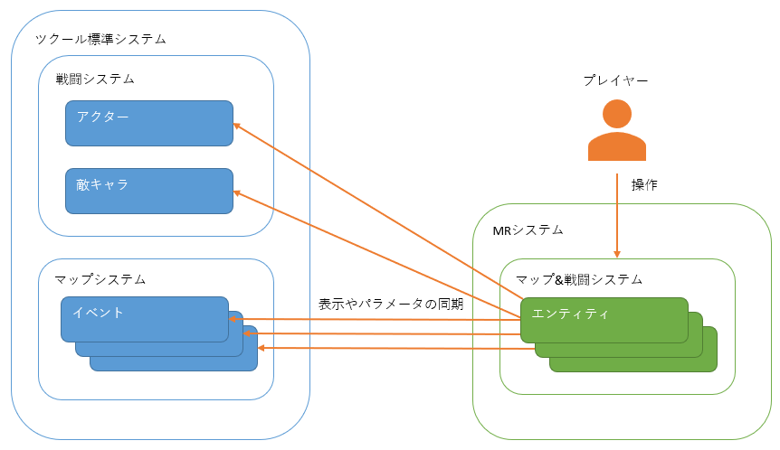

標準ゲームシステムとの関係
==========

このページでは、RPGツクール標準のゲームシステムと MRシステム がどのように関係するのかを説明します。

システムの独立性
----------

一般的にゲームシステムを拡張するプラグインは、RPGツクール標準のゲームシステムを変更する形でシステムを拡張します。

しかし MRシステム はそういったプラグインとは性質が異なり、RPGツクール標準システムとは互いに独立しています。

MRシステム は必要なタイミングでイベントの位置などを、 MRシステム側から制御することで、RPGツクール標準システムと自然に統合しているように見せています。

次のようなイメージを持つと、理解しやすいかもしれません。

- 不思議のダンジョンというゲームシステムが、あたかもミニゲームのように、ゲーム内の一部として存在している。
- ダンジョンマップに入ることで、このミニゲームが始まる。

注意点
----------

こういった独立性のため、以下に代表されるような注意点があります。

### 他プラグインの効果

MRシステムの戦闘システムはツクールのシステムとは完全に独立しているため、戦闘システムを拡張する他プラグインは効果がありません。

スキルの効果範囲や行動順の制御をといった、そもそも戦闘のルールが異なるため適用できないものはもとより、パラメータの制御や計算式の変更といった、一見 MRシステムでも利用できそうなものも効果はありません。

MRシステムを拡張したい場合、専用のプラグインを作る必要があります。

!!! tip
    逆に言うと戦闘システムにおいては、他プラグインとの競合が起こる可能性は極めて低いです。

### イベント実行内容

MRタクティクスマップ (いわゆるダンジョン内) では、イベントの移動やアクターのパラメータ変更といった、何らかの状態を変更するイベント実行内容は基本的に効果がありません。

前述の図のように、アクターのパラメータはエンティティ側から変更されるものとなります。
そのためアクターのパラメータを変更しても、エンティティのパラメータは変更されません。

効果があるイベントは、別途マニュアル内に記載します。ここでは、イベント実行には多くの制約がかかることを覚えておいてください。

