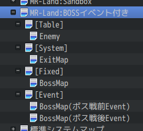
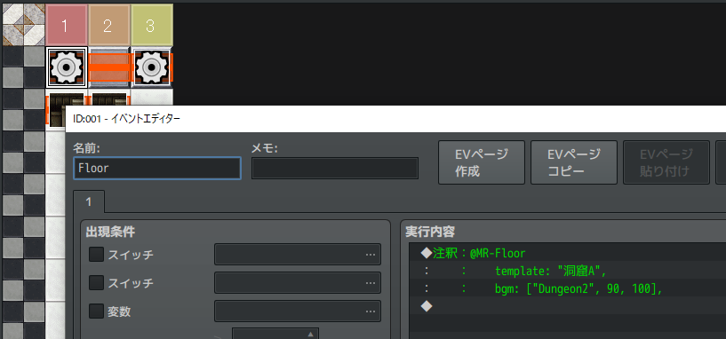
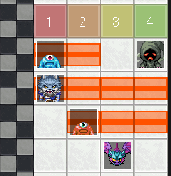
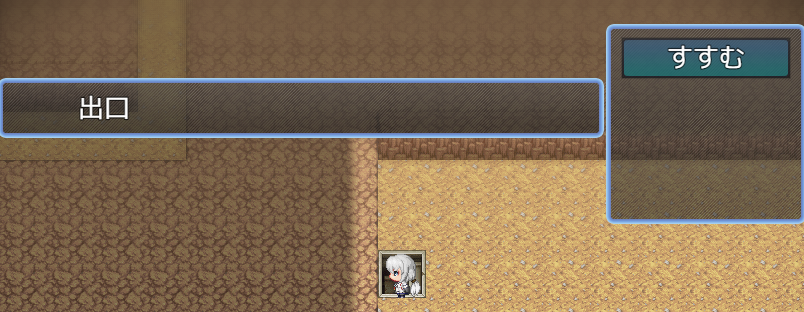
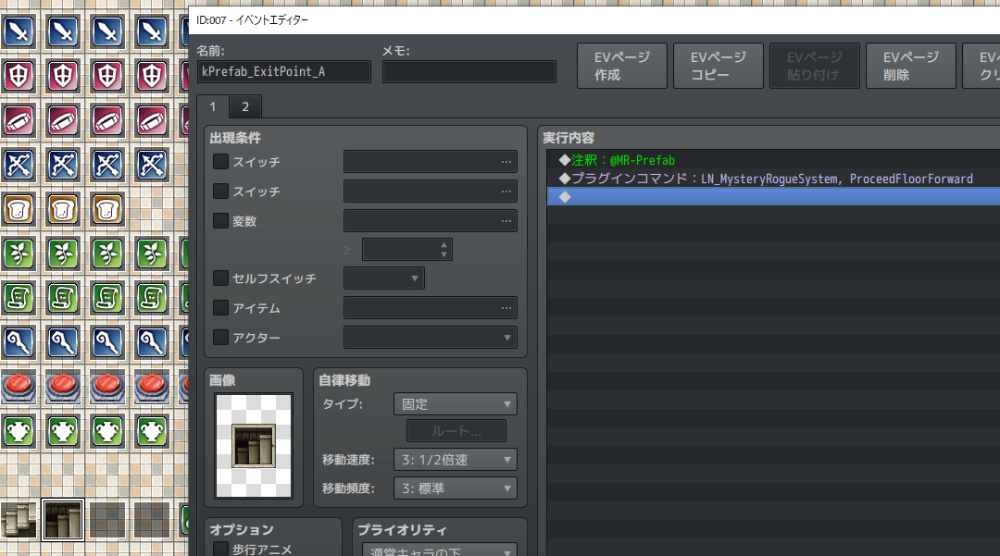
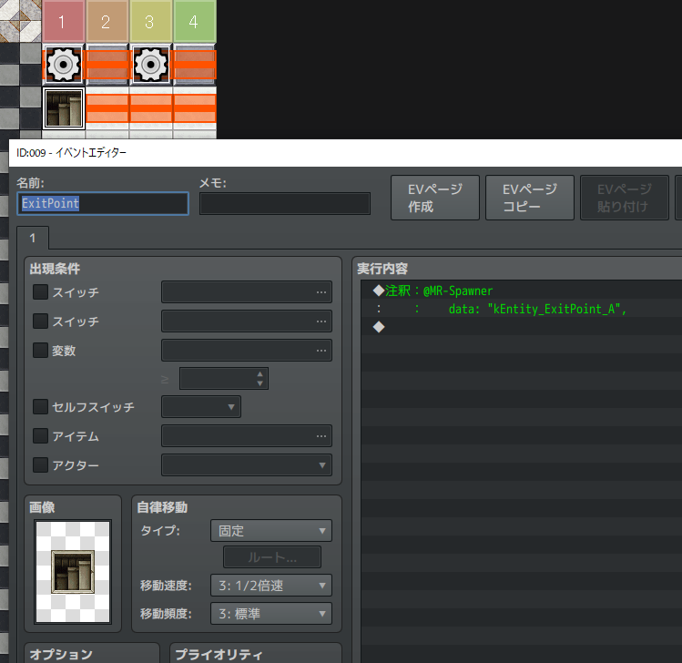
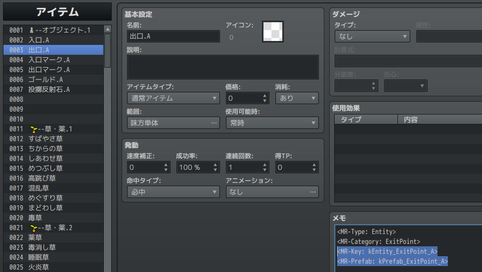

ダンジョン攻略の流れ
==========

このページでは、`ランド` (ダンジョン) を作るために必要なデータと、ランドへ突入してから出てくるまでの流れを説明します。

マップを確認する
----------

エディタのマップリストで、 `MR-Land:` から始まるマップを探してみましょう。

その子マップを見てみると、次ようになっています。

- MR-Land: 名前
    - [Table]
        - Item
        - Enemy
        - Trap
    - [System]
        - ExitMap
    - [Fixed]
        - いろいろ...
    - [Event]
        - いろいろ...

[Table], [Fixed] など [] で囲まれた名前のマップは、フォルダのようなものであると考えてください。
それぞれ次のような意味があります。

### MR-Land: 名前

`MR-Land:` から始まるマップを `ランド定義マップ` と呼びます。

このマップの横幅が、ランドのフロア数となります。

また注釈に `@MR-Floor` を書いたイベントを Y=1 座標に配置することで、フロアの構造や見た目を設定できます。

次の図は、F1 のフロア設定の例です。

### [Table]

アイテムやモンスターの出現テーブルです。この子マップは、X座標をフロア数とみなしてイベントを並べることで、どのフロアにどのエンティティが出現するのか設定することができます。
Item, Enemy, Trap は、それぞれ アイテム、モンスター、罠の出現テーブルです。

出現テーブルのルールは次の通りです。

- 出現させたい Entity は、注釈に `@MR-Spawner` と書いたイベントを配置して示す。

- 右方向に赤線タイルを伸ばすと、そのフロアの間は出現する。

なお、この `@MR-Spawner` と書いたイベントのことを `スポナーイベント` と呼びます。

### [System]

MRシステムとして特別な意味を持つマップです。
`ExitMap` という名前のマップは、何らかの理由でプレイヤーがダンジョンから離脱するときの遷移先となるマップです。(クリアした、敵に倒された、など様々)

ここに自動実行イベントを作成すると、ダンジョンから離脱した時のイベントを実行できます。

### [Fixed]

ボス部屋やシャッフルダンジョンなど、事前に形の決まったマップを作成するときは、このマップの子マップとして作成します。

### [Event]

ボス戦後のイベントなど、マップのツリービュー上でこのランドに近い場所に置いておきたい標準システムマップの置き場所です。
[Event] の子マップは常に標準システムマップとなります。

攻略の流れ
----------

ダンジョン突入からクリアまでにどのような設定やイベントの実行を辿るのかを説明します。

### ランド定義マップを確認する

ランド定義マップはX座標をフロア番号とみなして設定を行うマップです。

次のイベントが必ず必要です。

- フロア設定用イベント
- 出口(階段)のスポナーイベント

### ランドに入る

ランドに入るには、[場所移動] イベントを使って `ランド定義マップ` の、座標 (1,0) へ移動します。

### フロアを移動する

出口で [進む] アクションを実行すると、 `MR-Prefab` にある階段イベントの実行内容が起動します。

この実行内容にはプラグインコマンドの `ProceedFloorForward` が含まれています。これが実行されると、次のフロアに進みます。

ところで、なぜランドから遠く離れた MR-Prefab マップのイベントが実行されるのでしょうか？

まずはランド定義マップにある階段のスポナーイベントを見てみましょう。

`kEntity_ExitPoint_A` という文字列があります。既に説明したように、これは `MR-Key` が `kEntity_ExitPoint_A` である階段エンティティを出現させることを意味します。

`kEntity_ExitPoint_A` はデータベースの [アイテム] で定義されています。

このアイテムのメモ欄を見てみると、 `<MR-Prefab: kPrefab_ExitPoint_A>` という設定があります。

これはエンティティがマップ上に出現した時、その見た目には `kPrefab_ExitPoint_A` という名前のイベント(プレハブ)を使うことを意味します。

`kPrefab_ExitPoint_A` は、 `MR-Prefab` マップで定義されています。

このようにエンティティとプレハブは互いに重要な関係を持ちます。

### ランドを出る

最後のフロアで階段を下りたり、途中で倒されたりした場合、今のランドの中にある `ExitMap` という名前のマップへ自動的に移動します。

このマップに自動実行イベントを配置することで、ダンジョンクリア時や、ゲームオーバー時のイベントを実行することができます。

`ExitMap` へ移動した原因を知るには、 `MR-LandExitResult` という変数の値を確認します。

 `MR-LandExitResult` には次のような値が格納されます。

- 2: 攻略成功
- 3: 冒険中断。ペナルティ無し。
- 4: 冒険失敗。ペナルティ有り。(持ち物を失う等)

詳細は [変数](../../feature/rmmz-variables.md) を参照してください。

まとめ
----------

- ダンジョンは `ランド` と呼ばれます。
- ランド を作るには `ランド定義マップ` を作成します。 ランド定義マップ は名前の先頭が `MR-Land:` となっているマップです。
- ランド に入るには、[場所移動] イベントを使って ランド定義マップ の座標 (1,0) へ移動します。
- フロアの移動にはプラグインコマンド `ProceedFloorForward` を使います。
- イベント実行内容は `プレハブ` が持っています。
- 何らかの理由で ランド から出た場合、 `ExitMap` へ自動的に遷移します。ここに自動実行イベントを配置することで、出た後の処理をコントロールできます。

