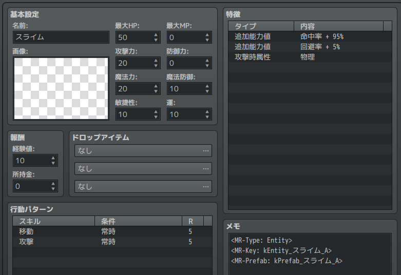
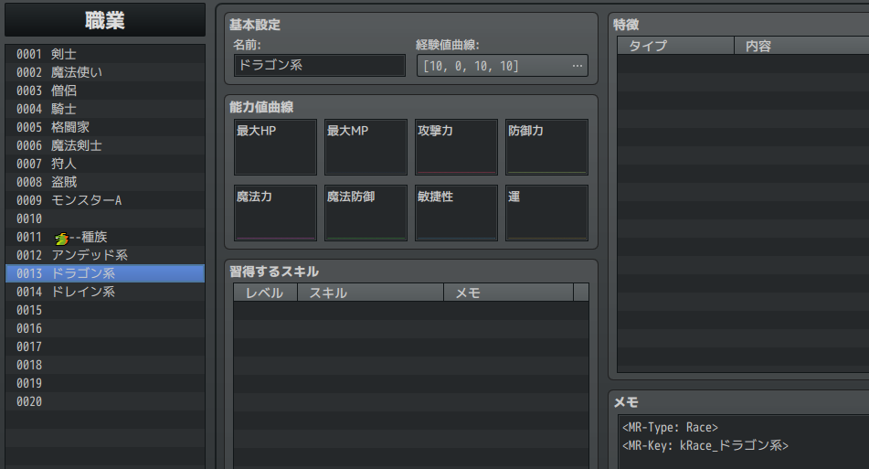
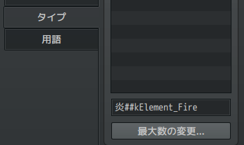

データベースの編集
==========

このページでは、データベースで編集できるデータとその種類について説明します。

エンティティ
----------

以前のページで、マップ上に登場できるオブジェクトは全て `エンティティ` であると説明しました。

RPGツクールのデータベースで編集できる次の要素は、すべてエンティティとなりえます。

- アクター
- アイテム
- 武器
- 防具
- 敵キャラ

例えば [敵キャラ] の "スライム.A" の [メモ] を見てみましょう。



次のように記述されているはずです。

```
<MR-Type: Entity>
<MR-Key: kEntity_スライム_A>
<MR-Prefab: kPrefab_スライム_A>
```

- `<MR-Type: Entity>` は、この情報がエンティティであることを示します。
- `<MR-Key: kEntity_スライム_A>` は、他の場所 (出現テーブルなど) からこのエンティティを検索するための名前を定義しています。このような名前を `Key` と呼びます。
- `<MR-Prefab: kPrefab_スライム_A>` は、このエンティティに対応するプレハブを指定しています。

### Key の命名ルール

```
k【データ種別】_【名前】
```

- 先頭の k は、この名前が Key であることを示す接頭辞です。
- 【データ種別】は、Entity、Prefab の他、この後の説明にもあるような Skill、 State など様々です。
- 【名前】は任意の文字列です。

このルールは必須ではありませんが、Key を見ただけで何のデータなのか分かりやすくするため、サンプルではこのようにしています。

!!! note "名前の後ろの .A や _A は何？"
    同名であるが効果の異なる特殊なアイテムを区別したり、data フォルダ内の名前の全置換をする際の名前衝突を防ぐための接尾辞です。
    例えば「毒矢」と「毒矢の罠」があるとき、「毒矢」だけ名前を変更したいときに「毒矢の罠」まで名前が変わってしまうことの対策です。

    名前の . から後ろは、実際のゲーム画面上には表示されません。

!!! tip "ID ではなく Key で！"
    MRシステムはほぼすべての設定で、ID (アイテムや敵キャラの番号) ではなく Key (MR-Key の値) でデータを設定したり検索します。
    これは、IDにしてしまうとパッと見た時に何を示しているのかわからなかったり、データベースの並び変えをしたときに正しいデータを参照できなくなる問題を回避するためです。

職業と種族
----------

`職業` は ツクール標準と同様に使用できます。これについては特にメモ欄はありません。

`種族` は MRシステム用のデータです。ツクールの [職業] エディタで作成できます。

例として、"ドラゴン系" のデータを見てみましょう。



[メモ] は次のようになっています。

```
<MR-Type: Race>
<MR-Key: kRace_ドラゴン系>
```

`<MR-Type: Race>` によって、このデータが種族データであることを示します。

詳細は [種族](../../feature/race.md) を参照してください。

スキル
----------

`スキル` は主にモンスターの特殊能力を表します。

例えば "毒攻撃" の [メモ] は次のようになっています。

```
<MR-Type: Skill>
<MR-Key: kSkill_毒攻撃>
```

`<MR-Type: Skill>` によって、このデータがスキルデータであることを示します。

詳細は [スキル](../../feature/skill.md) を参照してください。

トループ
----------

`トループ` は、1か所に複数のモンスターを出現させる時に使います。

データベースの `敵グループ` で設定可能で、メモ欄はありませんが、その名前を Key として扱います。

詳細は [トループ](../../feature/troop.md) を参照してください。

ステート
----------

`ステート` は、状態異常はもちろんですが、それ以外にも「呪い」「メッキ」あるいは「投げによる移動中であるか」など、エンティティの様々な状態を表します。

例えば "睡眠" ステートの [メモ] は次のようになっています。

```
<MR-Type: State>
<MR-Key: kState_睡眠>
<MR-StateGroup: kStateGroup_睡眠系>
```

`<MR-Type: State>` によって、このデータがスキルデータであることを示します。

詳細は [ステート](../../feature/state.md) を参照してください。

ステートグループ
----------

`ステートグループ` はステートをグループ化するためのオプション情報です。

例えば、"睡眠" と一言に言っても "仮眠" "空寝" "爆睡" など様々あります。しかしこれらは同時に付加したくはありません。
ステートグループは、そういった排他なステートを表現するために使用します。

ステートグループはステートの [メモ] で次のように設定します。

```
<MR-Type: StateGroup>
<MR-Key: kStateGroup_睡眠系>
```

詳細は [ステートグループ](../../feature/state-group.md) を参照してください。


属性
----------

`属性` はツクール標準システムと同様に使用できますが、MRシステムの設定として扱うために Key を設定できます。

Key を設定するには次のように、名前の後ろに ## を繋げて Key を記述します。


