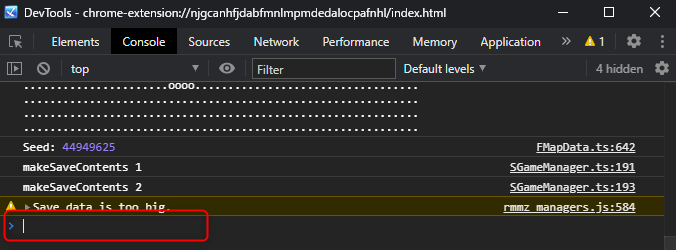

デバッグ機能
==========

このページでは、テストのためにダンジョンを効率よく攻略するための機能を紹介します。

デベロッパーツール
----------

テストプレイ中は F12 キーを押すことでデベロッパーツールを起動できます。

ここから [Console] タブを開くと、一番下にコマンドを入力することができます。

以下のコマンドを入力して Enter キーを押すと、様々な効果が得られます。

コマンド
----------

| コマンド | 効果 |
|----------|------|
| MR.levelMax() | プレイヤーキャラクターのレベルを最大値にします。 |
| MR.visitAll() | マップ・モンスター・アイテムを可視状態にします。 |
| MR.moveToExit() | 階段の上にワープします。 |

